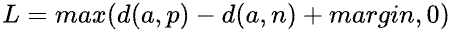
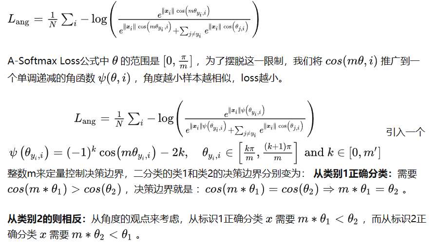
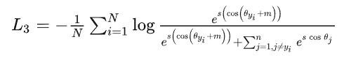

# 调研报告

## 概念解析
- gallery与probe：gallery指注册集或参考集，probe指查询集。通俗一点，gallery是数据库，probe是待识别的图片

### 评价指标
- mAP：mean Average Precision，平均准确率，是一种评价指标，用于评价检索系统的性能。mAP是所有类别AP的平均值。AP是每个类别的准确率，表示的是检测器在各个 Recall 值情况下准确率的平均值，对应的就是 PR 曲线下的面积（AUC， Area Under Curve）。mAP越高，说明检索系统性能越好。
- CMC: Cumulative Matching Characteristic curve，曲线横坐标是n，纵坐标是前n个结果（按模型给出的置信度排序）含正确结果的概率。
- mINP: mean Inverse Negative Penalty，令回收所有G_i个目标所用的猜测机会数为R_i，INP指G_i/R_i，mINP是所有类别INP的平均值。
- IoU（交并比，Intersection over Union）: IoU 计算的是 “预测的边框” 和 “真实的边框” 的交集和并集的比值。

### 损失函数
> 我们将使用Arcface loss
参考：https://zhuanlan.zhihu.com/p/128970124
更基础的参考：https://blog.csdn.net/qq_40321214/article/details/106467270
用于人脸识别的损失函数：基于Euclid Distance的损失函数（Contrastive Loss、Triplet Loss、Center Loss等），基于Angular Margin相关的损失函数（L-Softmax Loss、A-Softmax Loss、CosFace Loss、ArcFace Loss等）

决策边界：ArcFace：Additive Angular Margin，加法角度间隔 SphereFace：Multiplicative Angular Margin，乘法角度间隔 CosFace：Additive Cosine margin，加法余弦间隔

#### softmax loss
> 具有基础性的一个损失函数

其公式为：`Loss = -log(softmax value)`

#### contrastive loss
此损失拉近标签相同的样本的embedding，拉远标签不同的样本的embedding。其公式为：

其中$d=\left \| a_n-b_n  \right \| ^2$,代表两个样本的欧式距离，y为两个样本是否匹配的标签，y=1代表两个样本相似或者匹配，y=0则代表不匹配，margin为设定的阈值。

参考：https://www.jianshu.com/p/21be99fb58ca

#### triplet loss
参考：https://zhuanlan.zhihu.com/p/462539667

对一个三元组，包含一个锚点（anchor）、一个正样本（positive）和一个负样本（negative）。锚点和正样本是同一类的，而负样本则是和锚点不同类的。triplet loss的目标是让锚点和正样本的距离尽可能的小，而锚点和负样本的距离尽可能的大。

其公式为：

其中，d(a,p)表示锚点和正样本的距离，d(a,n)表示锚点和负样本的距离，margin是一个超参数，用来控制锚点和负样本的距离大于锚点和正样本的距离。一般来说，margin的值在0.2到0.5之间。

#### center loss
参考：https://zhuanlan.zhihu.com/p/137764312

为每一类的点与类中心距离的平均值。

一般将其与softmax loss加权求和使用如下：

#### Angular Margin相关损失函数
Angular Margin相关的损失函数就是把softmax loss改成对余弦值求softmax

而一般对类i求softmax值时，会对i项的指数进行更改，以增大类i与其它类的距离，如：

##### A-SoftMax
其公式如下：

##### CosFace Loss
其公式如下：

##### ArcFace Loss
其公式如下：

## Bike-Person Re-Identification: A Benchmark and a Comprehensive Evaluation
提出了第一个人-自行车数据集，并做了第一个进行人-自行车配对再识别的工作。

### 背景
BPReid数据集的特点：
1. 该数据集是第一个自行车-人员再识别数据集。
2. 从真实监控系统采样
3. 摄像头间距离远，涉及场所范围大

要考虑的困难有：光线、遮挡、视角、相似识别对象

相比人员再识别增加的困难有：
1. 人车对在不同角度看变化更大，特别是尺寸和轮廓方面（自行车侧看正看差别巨大）
2. 一辆自行车可以载多个人

### 方法
> 本文仅关心给出一个基本流程，故使用方法较基础，效果较差

流程：分割-特征提取-度量学习(Metric Learning)

分割方法极为粗浅，无参考价值

resize经验表明在其流程下识别精度对人像大小远比自行车图像大小更敏感（它的resize是含拉伸的）

特征提取方法可参考：ELF, LOMO and GOG，上GOG下ELF与上ELF下GOG的效果较好。一般来说，ELF提取局部特征，GOG提取全局特征。LOMO表现差，因为其涉及极大值，容易注意到噪声。

和度量学习(Metric Learning)配合使用时：MLAPG对单车效果较佳，鲁棒性较好，不过较耗时；改进的FDA如LFDA与XQDA也有较好的表现

## 11

